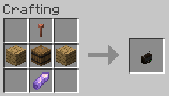
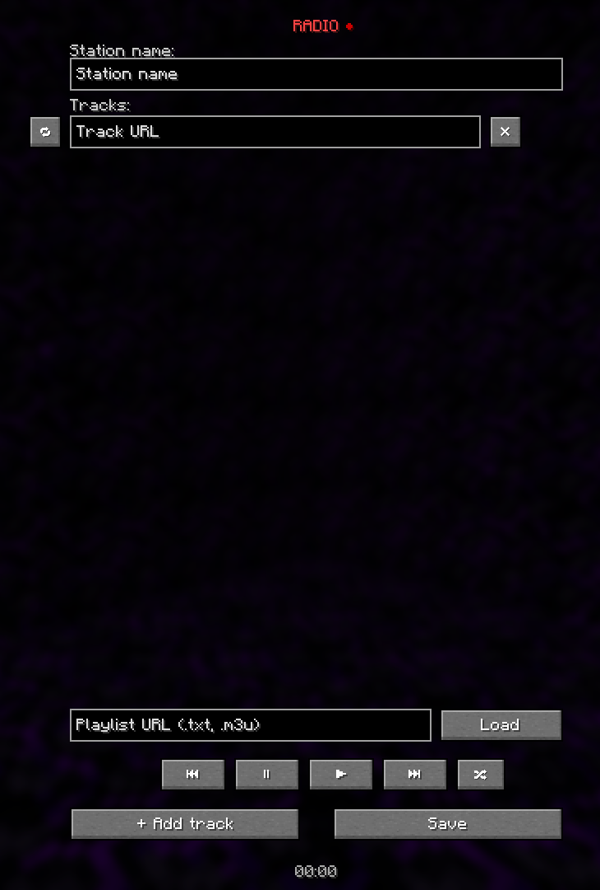

# RadioFM

A radio that plays on its own or through [Simple Voice Chat](https://modrinth.com/plugin/simple-voice-chat) or [Plasmo Voice](https://modrinth.com/plugin/plasmo-voice). Supports: YouTube, SoundCloud, Dropbox, Discord and direct links. You can play the radio whilst holding it or placed as a block.

Радио, которое играет само или через [Simple Voice Chat](https://modrinth.com/plugin/simple-voice-chat) или [Plasmo Voice](https://modrinth.com/plugin/plasmo-voice). Поддержка: YouTube, SoundCloud, Dropbox, Discord и прямые ссылки. Радио можно включать в руках или на блоке.

| | |
|---|---|
| Minecraft | 1.21.1 |
| Loader · Загрузчик | NeoForge |
| Optional · Необязательно | [Simple Voice Chat](https://modrinth.com/plugin/simple-voice-chat) or · или [Plasmo Voice](https://modrinth.com/plugin/plasmo-voice) |
| License · Лицензия | MIT |

[English](#english) · [Русский](#русский)

---

## English

### What it does

- Playlists from YouTube, SoundCloud, Discord, Dropbox and direct file links
- Track lists from a `.txt` or `.m3u` file
- Shuffle, repeat one track, pause, skip
- Carry a radio in hand or place it as a block - the sound follows the player or stays at a point in the world
- Plays through its own channel when no voice mod is installed, with a volume slider in the radio screen
- Works with Simple Voice Chat or Plasmo Voice, whichever the server has, with its own volume category in their settings
- The name of the playing track above the timer, and in the subtitles on its own channel

### Getting one

Craft it or hand it out with a command. The recipe takes any barrel and any amethyst, modded ones
included.



A lightning rod on top, planks either side of a barrel, an amethyst below.

### The screen



The station name and the track list are at the top: the button on the left loops a track, the cross
removes the row, the arrows next to it move the track up or down. Below are playlist loading, skip, pause, play and shuffle, with the time of the
current track underneath. On its own channel a volume slider sits in the top left corner.

### Controls

| Input | Effect |
|---|---|
| Right click a radio, held or placed | switch it on or off |
| Shift + right click | open the settings |
| Shift + mouse wheel | range, four blocks a notch |
| Shift + ctrl + wheel | range, one block a notch |

The wheel acts on the radio under the crosshair, or on the one in hand when there is none.

### Commands

```
/radiofm give                    hand out a radio
/radiofm give 64                 hand one out audible 64 blocks away
/radiofm give "Name"             hand one out named after a station
/radiofm give "Name" 64          both at once
/radiofm range <blocks> [x y z]  set the range of a held radio, or one at a position
/radiofm ban <player>            take radios away from a player
/radiofm unban <player>          give them back
/radiofm bans                    list who is banned
/radiofm choice <svc|pv|our>     pick the channel when a voice mod is installed
```

A ban covers everything: switching on, settings, range, and breaking someone else's radio. The list
lives in the world save and travels with it.

### Voice mods

Without a voice mod the radio plays through its own channel, nothing else needs installing. With
Simple Voice Chat, Plasmo Voice or both, it asks for a choice: an operator, or a player in their own
world with cheats on, runs `/radiofm choice svc`, `/radiofm choice pv` or `/radiofm choice our` for its
own channel. In a world without cheats, remove the voice mods you do not need and rejoin. The choice
is kept in `config/radiofm-server.toml`.

### Game rules

```
/gamerule radiofm:max 3            radios one player may have playing at once
/gamerule radiofm:maxRadius 64     the ceiling on range
```

`radiofm:max` counts both the radios a player placed and the one playing in their hand.

### Settings

`config/radiofm-server.toml`

| Key | Default | Meaning |
|---|---|---|
| `radio.range` | 48 | range for radios without one of their own |
| `radio.showMusicParticles` | true | notes above a playing radio |
| `radio.musicParticleFrequency` | 1000 | gap between notes, ms |
| `security.maxActiveRadios` | 32 | radios playing at once across the server |
| `security.maxTracksPerRadio` | 128 | tracks taken from one playlist |
| `security.maxPlaylistBytes` | 262144 | bytes read from a playlist file |
| `security.allowPrivateNetworks` | false | let radios reach addresses inside the server's network |
| `voice.voiceMod` | empty | `svc`, `plasmo` or `our` when a voice mod is installed |

### On security

The player writes the link and the server is what fetches it. Addresses inside the network -
`127.0.0.1`, the host's LAN, cloud metadata - are therefore refused. The check sits at the
connection, so redirects and DNS rebinding do not get around it.

Turn `allowPrivateNetworks` on only when the music sits in your own network.

### Building

```
./gradlew build
```

The jar lands in `build/libs/`.

---

## Русский

### Что умеет

- YouTube, SoundCloud, Discord, Dropbox и прямых ссылок на файлы
- Списки треков файлом `.txt` или `.m3u`
- Перемешивание, повтор трека, пауза, перемотка
- Радио работает в руке или на блоке - звук идёт с игроком или из точки мира
- Без голосового мода играет через свой канал, громкость - ползунком в окне радио
- Работает с Simple Voice Chat или Plasmo Voice, смотря что стоит на сервере, со своей категорией громкости в их настройках
- Название играющего трека над таймером, а на своём канале и в субтитрах

### Как получить

Скрафтить или выдать командой. Рецепт принимает любую бочку и любой аметист, включая модовые.


Громоотвод сверху, доски по бокам от бочки, аметист снизу.

### Окно настроек


Сверху название станции и список треков: кнопка слева зацикливает трек, крестик убирает строку,
стрелки справа от него двигают трек вверх или вниз.
Снизу загрузка плейлиста ссылкой, перемотка, пауза, воспроизведение и перемешивание. Под кнопками
идёт время текущего трека. На своём канале в левом верхнем углу - ползунок громкости.

### Управление

| Действие | Что делает |
|---|---|
| ПКМ по радио в руке или по поставленному | включить или выключить |
| Shift + ПКМ | открыть настройки |
| Shift + колесо мыши | слышимость, шаг 4 блока |
| Shift + Ctrl + колесо | слышимость, шаг 1 блок |

Колесо действует на радио под прицелом, а если его там нет - на то, что в руке.

### Команды

```
/radiofm give                    выдать радио
/radiofm give 64                 выдать со слышимостью 64 блока
/radiofm give "Название"         выдать с названием станции
/radiofm give "Название" 64      и то, и другое
/radiofm range <блоки> [x y z]   слышимость радио в руке или по координатам
/radiofm ban <игрок>             запретить игроку пользоваться радио
/radiofm unban <игрок>           снять запрет
/radiofm bans                    список запретов
/radiofm choice <svc|pv|our>     выбрать канал, если стоит голосовой мод
```

Запрет отбирает радио целиком: включение, настройки, слышимость и даже поломку чужого радио.
Список хранится в сохранении мира.

### Голосовые моды

Без голосового мода радио играет через свой канал, ставить больше ничего не нужно. Если стоит
Simple Voice Chat, Plasmo Voice или оба, оно попросит выбрать: оператор или игрок в своём мире с читами
вводит `/radiofm choice svc`, `/radiofm choice pv` или `/radiofm choice our` для своего канала. В мире
без читов уберите лишние голосовые моды и зайдите снова. Выбор хранится в `config/radiofm-server.toml`.

### Игровые правила

```
/gamerule radiofm:max 3            сколько радио игрок держит включёнными сразу
/gamerule radiofm:maxRadius 64     потолок слышимости
```

`radiofm:max` считает и поставленные игроком радио, и то, что играет у него в руке.

### Настройки

`config/radiofm-server.toml`

| Ключ | По умолчанию | Что делает |
|---|---|---|
| `radio.range` | 48 | слышимость, если у радио не задана своя |
| `radio.showMusicParticles` | true | нотки над играющим радио |
| `radio.musicParticleFrequency` | 1000 | пауза между нотками, мс |
| `security.maxActiveRadios` | 32 | сколько радио играет одновременно на сервере |
| `security.maxTracksPerRadio` | 128 | сколько треков берётся из плейлиста |
| `security.maxPlaylistBytes` | 262144 | сколько байт читается из файла плейлиста |
| `security.allowPrivateNetworks` | false | пускать радио по адресам внутри сети сервера |
| `voice.voiceMod` | пусто | `svc`, `plasmo` или `our`, если стоит голосовой мод |

### Про безопасность

Ссылку в радио вписывает игрок, а запрос по ней делает сервер. Поэтому адреса внутри сети -
`127.0.0.1`, локальная сеть хостера, метаданные облака - отклоняются. Проверка стоит на уровне
соединения, так что перенаправления и подмена DNS её не обходят.

`allowPrivateNetworks` включайте, только если музыка лежит в вашей же сети.

### Сборка

```
./gradlew build
```

Джарник появится в `build/libs/`.

---

## License · Лицензия

MIT · [LICENSE](LICENSE)

This is an independent implementation, not a fork. The idea of a radio inside voice chat is
[henkelmax](https://github.com/henkelmax)'s; his mod is All Rights Reserved and none of its code is
here.

Это самостоятельная реализация, а не форк. Идея «радио в голосовом чате» принадлежит
[henkelmax](https://github.com/henkelmax); его мод распространяется под All Rights Reserved,
и ни строки его кода здесь нет.
